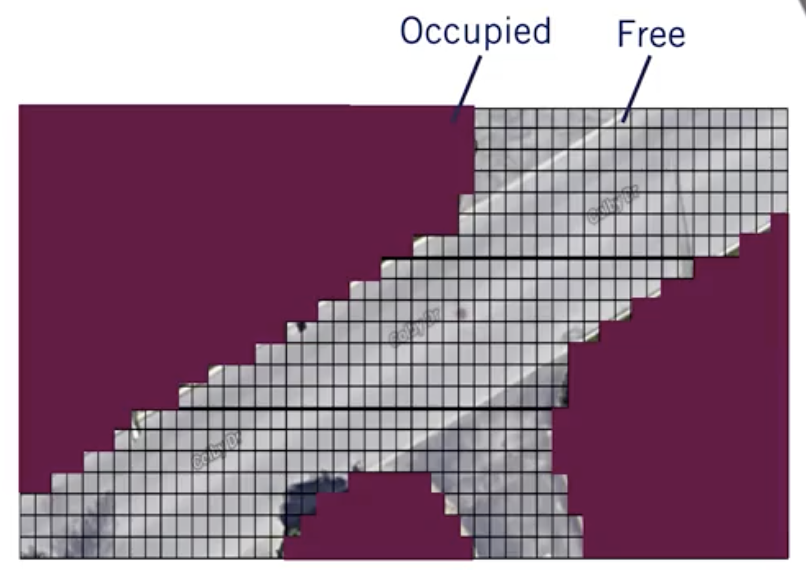

Taxonomy of Driving
===================

The driving task is composed of 3 sub-tasks:

-   Perception
-   Motion Planning
-   Controlling the vehicle

There is 6 levels to classify a driving system automation:

-   Level 0: No automation
-   Level 1: Driving assistance (longitudinal or lateral control)
-   Level 2: Partial driving automation (longitudinal and lateral
    control)
-   Level 3: Level 2 + OEDR (Object and Event Detection and Reponse)
-   Level 4: Level 3 + Fallback(Handles emergency: the driver can
    entirely focus on other tasks)
-   Level 5: Level 4 + Unlimited ODD (Operational Design Domain) can
    operate under any condition

Actually, the maximum available in the industry is the level 3, however
Waymo has deployed vehicle for public transport with the level 4 in a
defined geographic area.

Requirements for Perception
===========================

Perception is making sense of the environment and ourselves in the
environment.

The main tasks for perception are detecting and assessing various types
of static and dynamic objects and agents in the environment and the task
of making sense of how the vehicle is moving trough the environment.

Driving Decisions and Actions
=============================

There is differents types of planing: long term, short term and
immediate planning.

For this, we have 2 differents planning approaches: Reactive and
predictive planning. Obviously, the most we can use predictive planning,
better it is, however, reactive planning is sometimes unavoidable.

Sensors and Computing Hardware
==============================

2 types of sensors:

-   exteroceptive: relating to, being, or activated by stimuli received
    by an organism from outside

-   proprioceptive : of, relating to, or being stimuli arising within
    the organism

Among the sensors, we spoke about camera, LIDAR, RADAR, ultrasonics,
GNSS, IMU and wheel odometry.

To computing hardware, we need: - a self-driving brain - Image
processing, Objects detection, Mapping - Synchronization hardware

Hardware Configuration Design
=============================

For highways, we need sensors being able to complete 4 tasks:

For urban analysis, we need sensors being able to complete 6 tasks:

For recap, we need 3 types of sensors:

Software Architecture
=====================

Environment Representation
==========================

There is three types of maps commonly used in self-driving:

-   The localization map with points cloud 
-   The occupancy grid map 
-   The detailed road map 

Safety Assurance for Self-Driving Vehicles
==========================================

First, we see some of the autonomous driving accidents.

Safety terms:

-   Harm : Refer to the physical harm to a living thing.
-   Risk : Probability that a event occurs + severity of the harm of the
    event

Major Hazard Sources:

-   Mechanical
-   Electrical
-   Hardware
-   Software
-   Sensors
-   Incorrect planning or decision making
-   Fallback of the human
-   Cyber-attack

The National Highway Transportation Safety Administration or NHTSA, has
defined a twelve-part safety framework to structure safety assessment
for autonomous driving.

Industry Methods for Safety Assurance and Testing
=================================================

According to industry methods, in California, currently , Waymo had
driven 563 000km with 63 disengagements, it's 1 disengagement every
9000km. GM (General Motor) had driven 210 000km with 105 disengagement,
it's 1 disengagement every 2000km.

The question is to know: How many miles (in year) would autonomous
vehicles have to be driven to demonstrate with 95% confidence their
failure rate to within 20% of the true rate of 1 fatality per 146
millions km (= Human capabilities)

The answer is : \" It would take at least 400 years to do so with a
fleet of 100 vehicles traveling 24/7\"

Safety Frameworks for Self-Driving
==================================

There exists simple analytic framework: - Fault trees and probabilistic
fault trees - Failure modes and effect analysis

And functional safety framework: - FuSa HARA : Safety requirements
trough risk analysis - SOTIF : Behavior risk assessment
