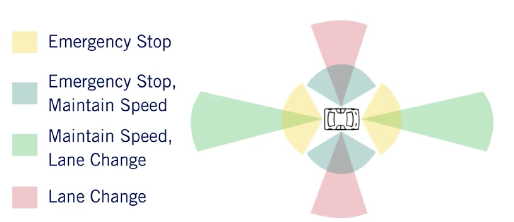
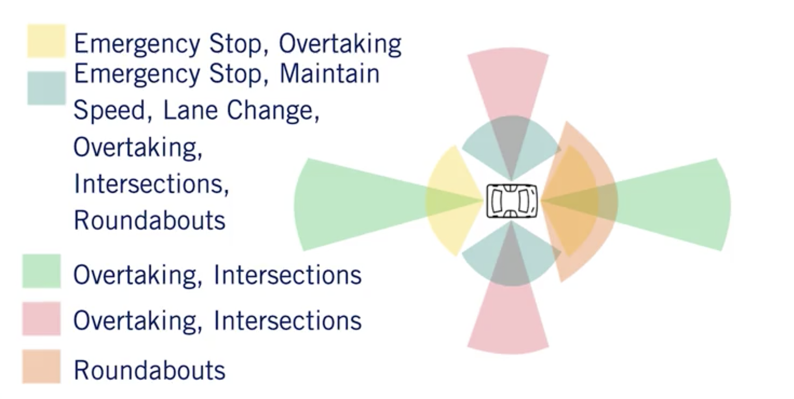
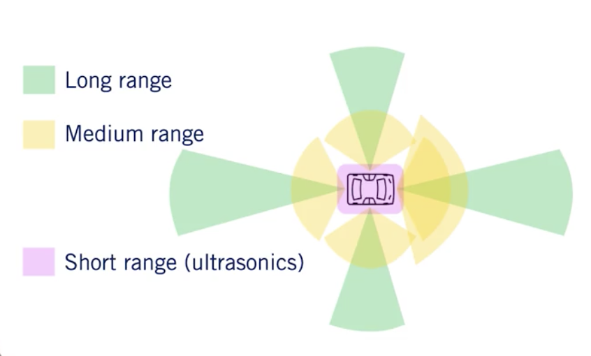
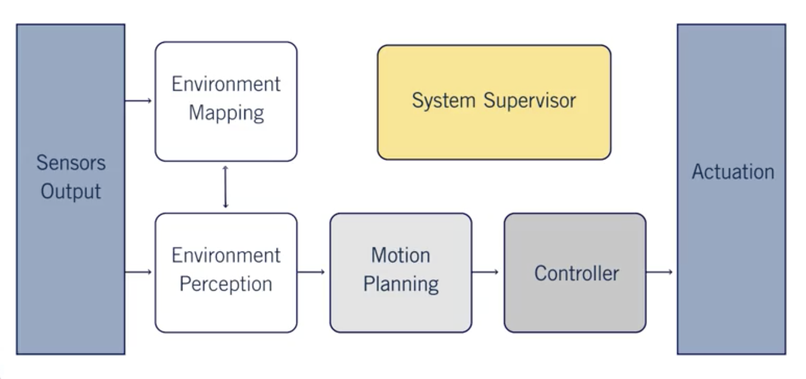
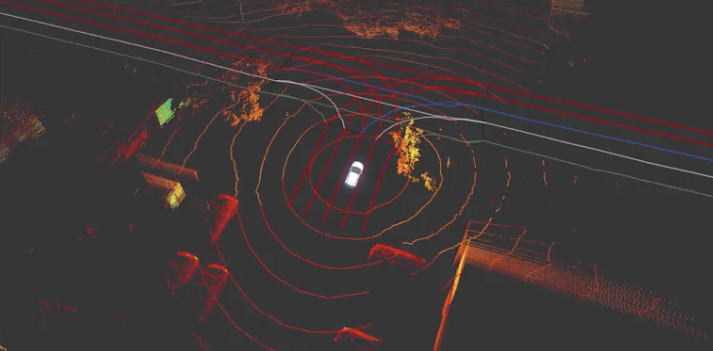
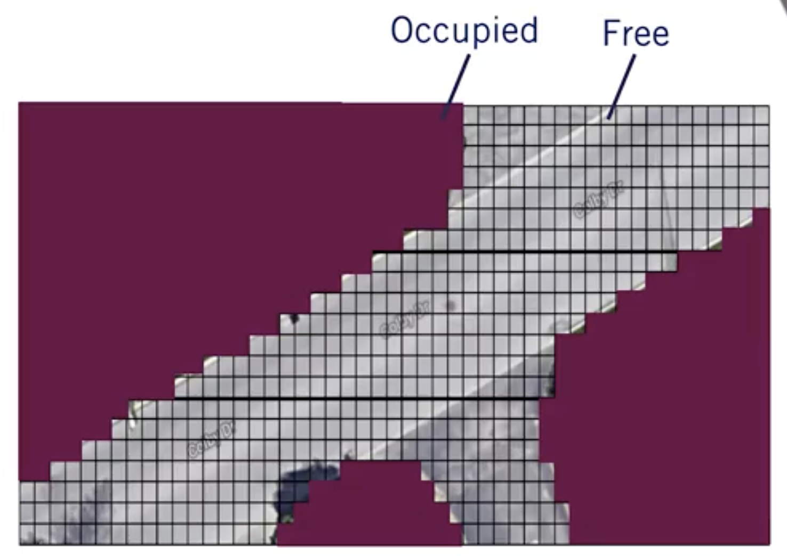
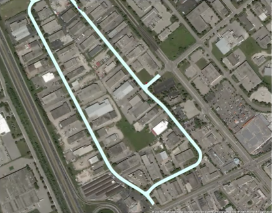

# Sensors and Computing Hardware

2 types of sensors:

- exteroceptive: relating to, being, or activated by stimuli received by an organism from outside

- proprioceptive : of, relating to, or being stimuli arising within the organism

Among the sensors, we spoke about camera, LIDAR, RADAR, ultrasonics, GNSS, IMU and wheel odometry.

To computing hardware, we need:
- a self-driving brain
- Image processing, Objects detection, Mapping
- Synchronization hardware

# Hardware Configuration Design

For highways, we need sensors being able to complete 4 tasks:

For urban analysis, we need sensors being able to complete 6 tasks:

For recap, we need 3 types of sensors:

# Software Architecture

# Environment Representation

There is three types of maps commonly used in self-driving:

- The localization map with points cloud

- The occupancy grid map

- The detailed road map

