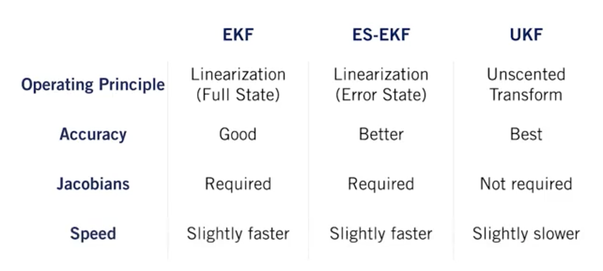
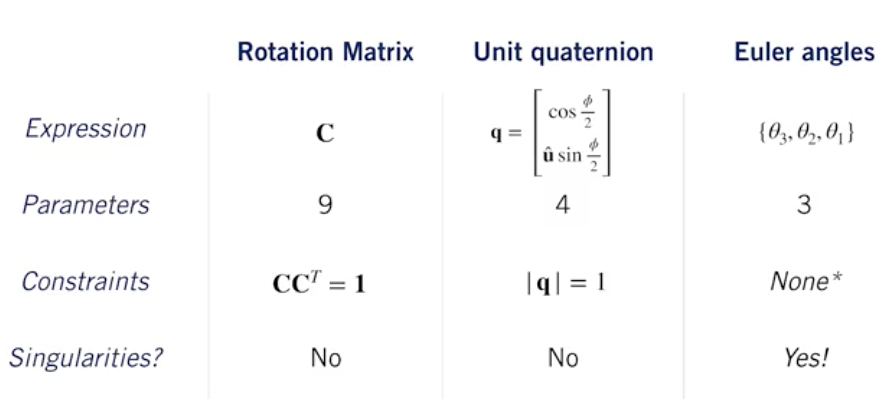

Introduction
============

(copy)In this course, we're going to dig into the other side of the
self-driving problem and learn about different types of sensors and how
we can use them for state estimation and localization in a self-driving
car. State estimation is the process of determining the best value of
some physical quantity from what are typically noisy measurements.

For self-driving, one of the most important types of state estimation is
localization, which is the process of determining where the car is in
the world and how it's moving.(copy) Thy is why state estimation is so
important.

Squared Error Criterion and the Method of Least Squares
=======================================================

To approximate the value of a parameter, usually, we base our
approximation to minimize the squared error criterion. To this, we use
the Method of Least Square, which come to use the arithmetic mean.
However, in Self-Driving car, we may want to trust certains measurements
more than the others due to better sensors.

This is why we prefere to use Weighted Least Squares. Here is a recap of
the difference between the two methods:

Recursive Least Squares
=======================

To use the precedent Least Square's Methods, we made a assumption: that
we have a batch of data. This is assumption is regurlarly false in Self
Driving Cars. So, we use the Recursive Least Squares in order to
produces a 'running estimate' of parameter(s) for a stream of
measurements. It's a recursive linear estimator that minimizes the
variance of the parameters at the current time.

Least Squares and the Method of Maximum Likelihood
==================================================

(copy)A self-driving car will have to deal with many, many sources of
error, some of which are very difficult to model. However, the central
limit theorem tells us that when combining all of these errors together,
they can reasonably be modeled by a single Gaussian error distribution.
We would like to model our system probabilistically and yet maintain
simplicity in calculations. If our errors are Gaussian, then the best
maximum likelihood estimate of the parameters of interest is exactly the
least squares solution we're already familiar with, easy.(copy)

Warning: Outliers can significantly affect our estimate value!

The (Linear) Kalman Filter
==========================

While Recursive least squares updates the estimate of a static
parameter, Kalman filter is able to update and estimate of an evolving
state. It use two steps to take a probabilistic estimate of the state
and update it in real time: prediction and correction.

In this way, we can think of the Kalman filter as a technique to fuse
information from different sensors to produce a final estimate of some
unknown state, taking into account, uncertainty in motion and in our
measurements.

Kalman Filter and The Bias BLUEs
================================

During this lesson, we have seen that given our linear formulation, and
zero-mean , white-noise: The Kalman Filter is unbiased. We have also
seen that it is consistent.

If we have white , uncorrelated zero-mean noise, the Kalman filter is
the best unbiased estimator that uses only a linear combination of
measurements. So, we call it the BLUE (Best Linear Unbiased Estimator)

Going Nonlinear - The Extended Kalman Filter
============================================

The classic Kalman Filter is linear. However, in reality, there is no
full linear model. So, we discover the Exttended Kalman Filter.

The EKF is designed to work with nonlinear systems, and it's often
considered one of the workhorses of state estimation It uses first-order
linearization to turn a non-linear problem into a linear one.

Linearization works by computing a local linear approximation to a
nonlinear function using a first-order Taylor series expansion about an
operating point.

An Improved EKF - The Error State Extended Kalman Filter
========================================================

True state: ex : True position Nominal State: Calculate position Error
state: True position - Calculate position

Instead of doing Kalman filtering on the full state which might have
lots of complicated non-linear behaviors, we're going to use the EKF to
estimate the error state instead, and then use the estimate of the error
state as a correction to the nominal state. It's called the ES EKF
(Error State Extended Kalman Filter)

Limitations of the EKF
======================

If the dynamics of the system being modeled are highly non-linear or the
linearization error is large, the filter may diverge. This means that
linearization error can cause our estimator to be overconfident in a
completely wrong answer. Also, the EKF requires Jacobian matrices to be
computed which is often a tedious and error-prone process.

An Alternative to the EKF - The Unscented Kalman Filter
=======================================================

Intuition of the Unscented Transform: "It's typically much easier to
approximate a probability distribution, than it is to approximate an
arbitrary nonlinear function"

(copy) UKF uses the Unscented Transform to adapt the Kalman Filter to
nonlinear systems. The Unscented Transform works by passing a small set
of carefully chosen samples through a nonlinear system and computing the
mean and covariance of the outputs, and it often does a much better job
of approximating the output distribution than the local analytical
linearization technique used by the EKF for similar computational cost.
(copy)

Summarize
=========

3D Geometry and Reference Frames
================================

Vector quantities can be in different reference frames trough rotations
and translations. First, we talk about different representation of
rotations, with their advantages and drawbacks, let's have a recap here:

For localization, ECEF (Earth-Centered Earth-Fixed Frame), ECIF
(Earth-Centered Inertial Frame) and Navigation frames are important.

The Inertial Measurement Unit (IMU)
===================================

An IMU is composed of:

-   gyroscopes (measure angular rotation rates about three separates
    axis)

-   accelerometers (measure accelerations along three orthogonal axes)

IMUs are tricky to calibrate and drift over time so we'll use the modern
system of global navigation satellites to periodically correct our posed
estimates.

The Global Navigation Satellite Systems (GNSS)
==============================================

Global Navigation Satellite Systems work by combining pseudoranges from
at least four satellites to determine a 3D position.

It exist different improvents of the GPS, let's see:

Light Detection and Ranging Sensors
===================================

LIDAR sensors use lasers pulses and time-of-flight to measure distances
to objects along a specific direction. For 2D or 3D LIDARs work by
sweeping the laser pulses in many directions across the whole
environment. Considering the operation of a LIDAR, we should be aware of
some sources of measurement noise:

-   Uncertainty in determining the exact time of arrival of the
    reflected signal.
-   Uncertainty in measuring the exact orientation of the mirror.
-   Interaction with the target (ex: surface absorption)
-   Variation of propagation speed.

Also, for a moving vehicle, each point in a scan is taken from a
slightly different place. We need to take this into account, otherwise,
for a quickly moving vehicle, the motion distorsion can become a
problem.

LIDAR Sensor Models and Point Clouds
====================================

We will need to do 3 operations on Point Clouds:

-   Translation
-   Rotation
-   Scaling

For this, we will use a data structure like this:

We assign an index to each of the points, say point 1 through point n,
and store the x, y, z coordinates of each point as a 3 by 1 column
vector. We stack them side by side into a matrix that we'll call big P.
Doing it this way make it easier to work with the standard linear
algebra libraries, like the Python NumPy library, which lets us take
advantage of fast matrix operations.

For doing basic and advanced operations on point clouds, we have the
open-source Point Cloud Library (PCL) built with C++ but it exists
unofficial python binding available.

Pose Estimation from LIDAR Data
===============================

To determine the motion of a self-driving car by aligning points clouds
from LIDAR, we use ICP (Iterative Closest Point) algorithm. It works by
iteratively minimizes the distance between points in each point clouds.

Moving objects violate the stationary world assumption that ICP is based
on, so it can be a problem. These outlier measure can be mitigated by
using Robust Loss Functions which assign less weight to large errors
than the usual squared error loss.

State Estimation in Practice
============================

In practice, state estimation typically fuses data from multiple sensors
like IMUs, LiDAR, cameras, and GPS or GNSS receivers. For a correct
sensor fusion, the calibration is very important. We need to consider
the relative positions and orientations of all the sensors and any
differences in polling time. We need to think about how to safely cope
with localization failures and aspects of the world that do not conform
to our assumptions such as moving objects.

Multisensor Fusion for State Estimation
=======================================

For vehicular state estimation, we use EKF(Extended Kalman Filter). In
order to fuse GNSS with IMU and LIDAR measurements.

For this we made some assumption:

-   LIDAR provides position in the same reference frame as GNSS.
-   IMU has no biases.
-   State initialization is provided.
-   Our sensors are spatially and temporally aligned.

Sensor Calibration - A Necessary Evil
=====================================

Sensor fusion is impossible without calibration, for this, we have to
deal with 3 types of calibatrion:

-   Intrinsic Calibration: sensors specific parameters.

-   Extrinsic Calibration: how the sensors are positioned and oriented
    on the vehicle.

-   Temporal calibration: Time offset between different sensors
    measurements

Loss of One or More Sensors
===========================

We have seen different examples of car crashing because of a sensor
malfunction and a bad management of this failure. For this, multiple
sensors are crucial to robust localization in varied environment.
