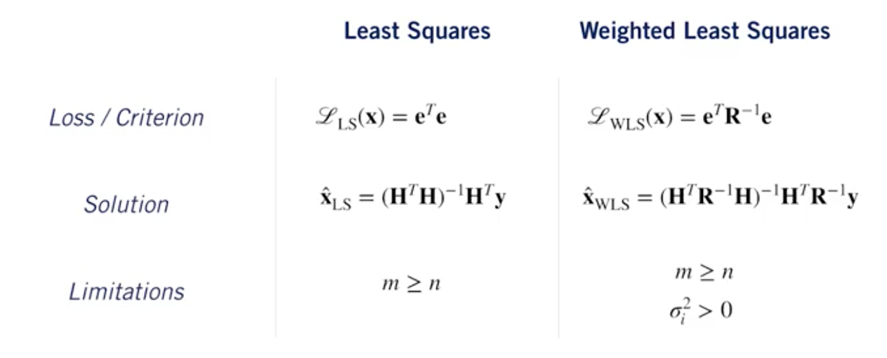

# Introduction

(copy)In this course, we're going to dig into the other side of the self-driving problem and learn about different types of sensors and how we can use them for state estimation and localization in a self-driving car.
State estimation is the process of determining the best value of some physical quantity from what are typically noisy measurements.

For self-driving, one of the most important types of state estimation is localization, which is the process of determining where the car is in the world and how it's moving.(copy) Thy is why state estimation is so important.

# Squared Error Criterion and the Method of Least Squares

To approximate the value of a parameter, usually, we base our approximation to minimize the squared error criterion.
To this, we use the Method of Least Square, which come to use the arithmetic mean. However, in Self-Driving car, we may want to trust certains measurements more than the others due to better sensors.

This is why we prefere to use Weighted Least Squares. Here is a recap of the difference between the two methods:

# Recursive Least Squares

To use the precedent Least Square's Methods, we made a assumption: that we have a batch of data. This is assumption is regurlarly false in Self Driving Cars. So, we use the Recursive Least Squares in order to produces a 'running estimate' of parameter(s) for a stream of measurements. It's a recursive linear estimator that minimizes the variance of the parameters at the current time.

# Least Squares and the Method of Maximum Likelihood

(copy)A self-driving car will have to deal with many, many sources of error, some of which are very difficult to model. However, the central limit theorem tells us that when combining all of these errors together, they can reasonably be modeled by a single Gaussian error distribution. We would like to model our system probabilistically and yet maintain simplicity in calculations. If our errors are Gaussian, then the best maximum likelihood estimate of the parameters of interest is exactly the least squares solution we're already familiar with, easy.(copy)

Warning: Outliers can significantly affect our estimate value!
