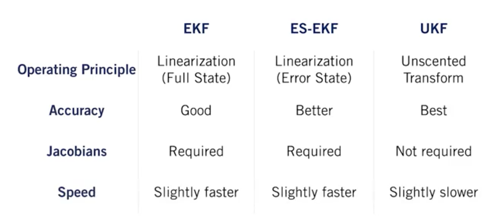

# The (Linear) Kalman Filter

While Recursive least squares updates the estimate of a static parameter, Kalman filter is able to update and estimate of an evolving state. It use two steps to take a probabilistic estimate of the state and update it in real time: prediction and correction.

In this way, we can think of the Kalman filter as a technique to fuse information from different sensors to produce a final estimate of some unknown state, taking into account, uncertainty in motion and in our measurements.

# Kalman Filter and The Bias BLUEs

During this lesson, we have seen that given our linear formulation, and zero-mean , white-noise: The Kalman Filter is unbiased. We have also seen that it is consistent.

If we have white , uncorrelated zero-mean noise, the Kalman filter is the best unbiased estimator that uses only a linear combination of measurements. So, we call it the BLUE (Best Linear Unbiased Estimator)

# Going Nonlinear - The Extended Kalman Filter

The classic Kalman Filter is linear. However, in reality, there is no full linear model. So, we discover the Exttended Kalman Filter.

The EKF is designed to work with nonlinear systems, and it's often considered one of the workhorses of state estimation
It uses first-order linearization to turn a non-linear problem into a linear one.

Linearization works by computing a local linear approximation to a nonlinear function using a first-order Taylor series expansion about an operating point.

# An Improved EKF - The Error State Extended Kalman Filter

True state: ex : True position
Nominal State: Calculate position
Error state: True position - Calculate position

Instead of doing Kalman filtering on the full state which might have lots of complicated non-linear behaviors, we're going to use the EKF to estimate the error state instead, and then use the estimate of the error state as a correction to the nominal state. It's called the ES EKF (Error State Extended Kalman Filter)

# Limitations of the EKF

If the dynamics of the system being modeled are highly non-linear or the linearization error is large, the filter may diverge.  This means that linearization error can cause our estimator to be overconfident in a completely wrong answer.
Also, the EKF requires Jacobian matrices to be computed which is often a tedious and error-prone process.

# An Alternative to the EKF - The Unscented Kalman Filter

Intuition of the Unscented Transform: "It's typically much easier to approximate a probability distribution, than it is to approximate an arbitrary nonlinear function"

(copy)
UKF uses the Unscented Transform to adapt the Kalman Filter to nonlinear systems. The Unscented Transform works by passing a small set of carefully chosen samples through a nonlinear system and computing the mean and covariance of the outputs, and it often does a much better job of approximating the output distribution than the local analytical linearization technique used by the EKF for similar computational cost.
(copy)

# Summarize

