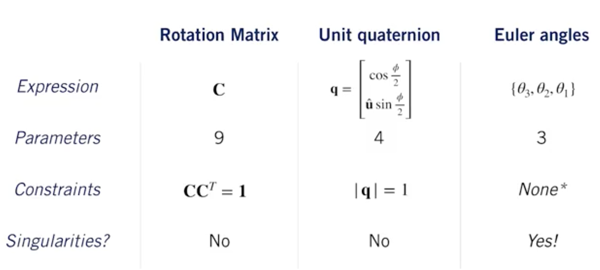
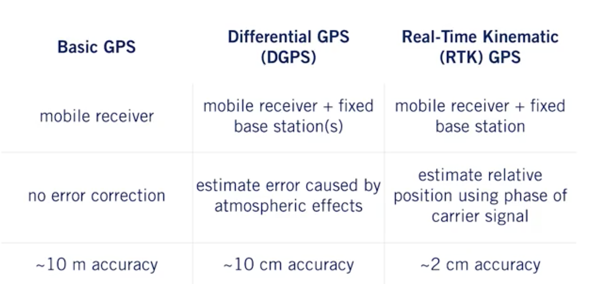

# 3D Geometry and Reference Frames

Vector quantities can be in different reference frames trough rotations and translations.
First, we talk about different representation of rotations, with their advantages and drawbacks, let's have a recap here:

For localization, ECEF (Earth-Centered Earth-Fixed Frame), ECIF (Earth-Centered Inertial Frame) and Navigation frames are important.

# The Inertial Measurement Unit (IMU)

An IMU is composed of:

- gyroscopes (measure angular rotation rates about three separates axis)

- accelerometers (measure accelerations along three orthogonal axes)

IMUs are tricky to calibrate and drift over time so we'll use the modern system of global navigation satellites to periodically correct our posed estimates.

# The Global Navigation Satellite Systems (GNSS)

Global Navigation Satellite Systems work by combining pseudoranges from at least four satellites to determine a 3D position.

It exist different improvents of the GPS, let's see:

