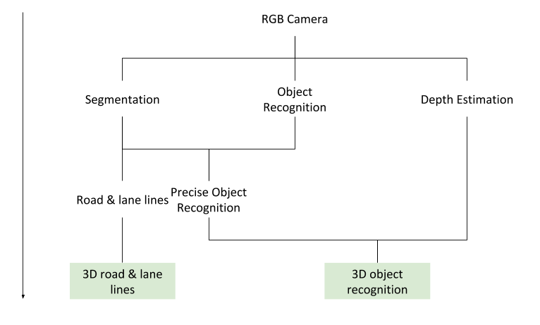

# SelfDrivingCarsCourse

## PARTIE 1 JORAN

## PARTIE 2 JORAN

## Visual Perception for Self-Driving Cars

The goal of the perception stack is to provide the motion planning stack enough
information about the driving environment so that the latter can achieve its
mission in a safe and efficient way.

The perception task is (in a way) already solved. We know how to do object
recognition, classification, segmentation, even monocular depth estimation. We
can do instance segmentation and track dynamic objects as long as they're 
covered by camera/LIDAR. The only remaining question is what does the motion
planner needs ? 

This however is still an area of active research. We could look at it in 2
different ways:
  1. End-to-end solution, the vision stack outputs the behavior.
  1. Output as much info as possible from the vision stack, then find a way to
     solve motion planning.

In this part, we'll talk about the second solution. Let's assume, for the sake
of simplicity, that we need to know 3 things to drive car:
  1. We need to know where should we drive, i.e. road and lane lines
  1. We should know the position of the other agents (cars, pedestrains, etc.)
     in the same environment, so that we can drive without colliding.
  1. We have to be aware of the regulatory elements in our driving
     environment (stop signs, crosswalks, etc.)

All of this can be achieved just with an RGB camera input, with just 3
deep learning models.

### Segmentation
Image segmentation is the process of classifying every pixel of an image into
a given set of labels. In this case, we can think of different types of labels:
dynamic object, road, regulatory element, etc.

### Object Recognition
Object recognition is the process of recognizing and classifying objects in a
driving scene. The ouput is a set of bounding boxes and the corresponding 
labels

### Depth Estimation
Depth estimation is the process of estimating a pixel's depth.
Depth estimation is usually done with stereovision (2 cameras). However, recent
advances in deep learning has made it possible to train unsupervised models to
depth estimation.

### Putting it all together
If we piece it all together, we get the following:

## Motion Planning for Self-Driving Cars
The motion planning task can be grouped into a list of behaviours:
  * follow lead car
  * make a U-turn
  * decelerate to stop
  * yied
  * etc.

The motion planner uses a behavioural planner to choose a behaviour according
to the driving scenario. And then a local planner computes, for this behavior,
the path and velocity profile.

This path have to be feasible and collision free. So the following constraints
apply:
  * Curvature of the path can't exceed a limit
  * Maximum magnitude of lateral forces on the tires before stability loss
  * Static obstacles that blocks portions of the drivable space
  * Dynamic obstacles
  * Rules of the road and regulatory elements

### Behaviour planner
Typically uses one of the 3 following architectures:
  * Finite state machines. Set of states and their transitions.
  * Rule-based systems. A set of if conditions.
  * Reccurent learning based methods.

It takes as inputs:
  * High definiton road map (road map with all the regulatory elements)
  * Mission path (Start and end of the trip)
  * Localization
  * Perception stack output

And outputs:
  * Manoeuvre (or behaviour)
  * Set of constraints (optimal path if there is no other agent or obstacle,
    speed limit, lane boundaries)

### Local planner
For the path planning task:
  * Sampling based planner. Randomly samples the searchspace until a good
  enough path is found.
  * Variationnal planner. Optimizes the trajectory according to a cost function.
  * Lattice planner.

For the velocity profilte generation, we optimize the following values:
  * Smoothness. Minimize jerk (derivative of the acceleration)
  * Deviation from reference, i.e. optimal path (which can be unfeasible)
  * Acceleration limit
